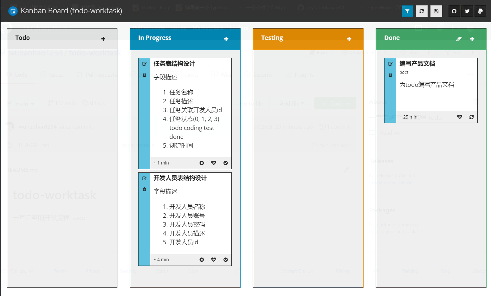

# todo-worktask

一套完整的敏捷开发规范-todo

## 项目管理工具

vscode + kanban

## 需求

需要制作一个类似worktile/禅道的项目管理工具

## 核心需求

- [ ] 开发人员增删改查

- [ ] 任务与人员的关联 任务的增删改查

- [ ] 描述任务进度

## 需求拆分

1. 数据库表结构设计

  - [x] 开发人员表结构设计
  - [x] 任务表结构设计

  后期可加入文档表结构设计

2. 后端接口编写

  - [ ] 超级管理员对于开发人员的增删改查接口
  - [ ] 开发人员登录接口
  - [ ] 超级管理员对于任务的创建，增加，删除，更改接口
  - [ ] 任务与开发人员的关联接口

3. 前端实现

普通开发人员： 

  - [ ] 登录界面
  - [ ] 查看任务列表
  - [ ] 添加任务
  - [ ] 关联任务(开发人员与任务的绑定)

超级管理员

  - [ ] 登录界面
  - [ ] 对于任务的增删改查, 与普通开发人员一致
  - [ ] 开发人员的增删改查